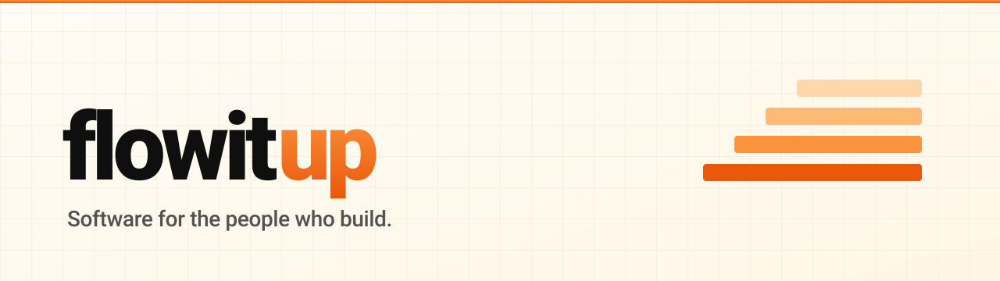
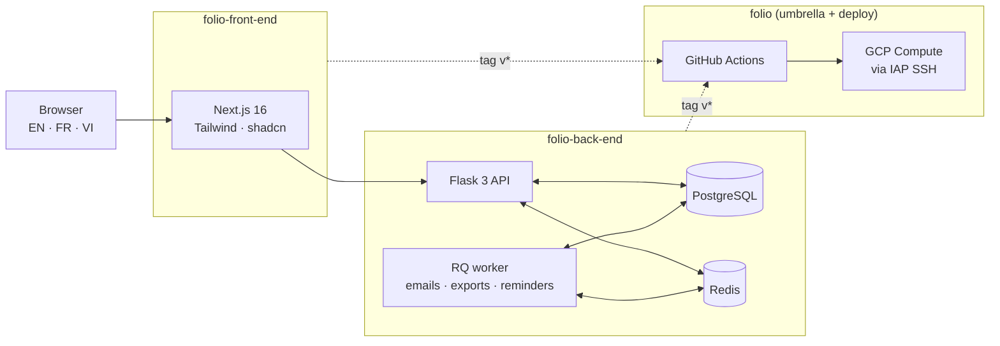

<picture>
  <source media="(prefers-color-scheme: dark)" srcset="./assets/banner-dark.svg">
  <source media="(prefers-color-scheme: light)" srcset="./assets/banner-light.svg">
  
</picture>

  
  
  

  <em>A small product team in France, building software that takes the headache out of running a construction business.</em>

---

## Folio — what we ship

[**folio.flowitup.com**](https://folio.flowitup.com) is the only thing flowitup ships right now. It is a Construction Management System for small and mid-sized construction companies — the kind of business that runs on WhatsApp threads, paper attendance sheets, and Excel files mailed back and forth.

Folio is what those companies use instead.

### What you can do with it

- **Projects** — keep every site (an office tower, a riverside building, a renovation) in its own workspace, with its own team and address.
- **Team & roles** — invite people by email; each member gets a role (owner, manager, foreman, accountant, viewer) that decides what they can see and do.
- **Labor tracking** — log who worked which day, full or half day, plus extra "supplement" hours that are automatically converted into bonus days at month-end.
- **Excel & PDF exports** — labor reports for any 1-to-24-month window. French currency formatting, Vietnamese accents render correctly.
- **Invoices** — Client, Labor and Supplier invoices with line items and a print-clean view.
- **Notes & reminders** — post a note with a due date; every project member gets reminded in the bell-icon dropdown when the lead time hits.
- **Three languages** — English, French, Vietnamese. Light, dark and system theme.

---

## Stack

  
  
  
  
  
  
  
  
  
  
  
  

---

## Architecture, at a glance

The umbrella `folio` repo ties together the back-end and front-end as submodules and runs the deploy workflows. A version tag in either sub-repo dispatches a deploy job in `folio` that builds an image, pushes to Artifact Registry, SSHs into the GCP VM via IAP, runs smoke tests, then bumps the submodule pointer back on `master` so the parent always reflects the SHA running in prod.

---

## Active projects

| | Repo | What it is | Stack |
|---|---|---|---|
| 🔒 | [`folio`](https://github.com/flowitup/folio) | Umbrella repo — submodules, infra, deploy workflows, docs | Shell · GitHub Actions |
| 🔒 | [`folio-back-end`](https://github.com/flowitup/folio-back-end) | The API behind Folio | Python · Flask · SQLAlchemy · RQ |
| 🔒 | [`folio-front-end`](https://github.com/flowitup/folio-front-end) | The web app you click on | TypeScript · Next.js · Tailwind · shadcn |

Repos are private while Folio is in beta. If you are a member of the org the links above will take you in; otherwise GitHub will return a 404.

---

## Team

  <a href="https://github.com/ducxyz">
     
    <b>@ducxyz</b>
  </a>
  &nbsp;&nbsp;&nbsp;&nbsp;
  <a href="https://github.com/yaiba2307">
     
    <b>@yaiba2307</b>
  </a>

---

## Get in touch

Found a bug? Have a feature request? Curious about Folio?

→ [**Open an issue on `flowitup/.github`**](https://github.com/flowitup/.github/issues/new) and we will see it.

---

  
    Made with care in France &middot; Source is currently closed while Folio is in beta &middot; &copy; 2026 flowitup
  

